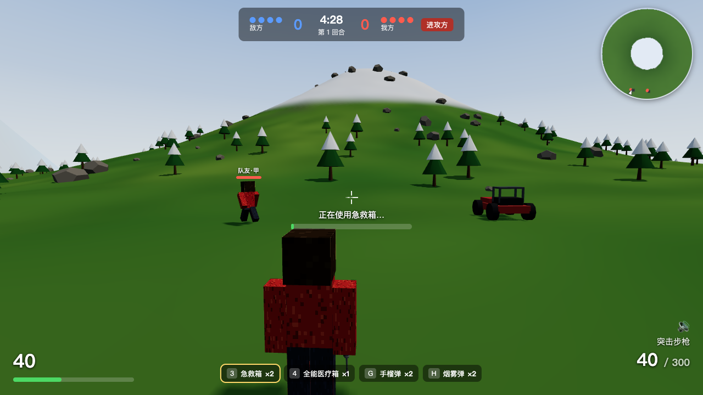

# Uphill Battle · 攻山

** 在线玩：https://aleonchen.work/uphill-battle/  **（GitHub Pages，无需下载）



> Built with [Kimi K3](https://www.moonshot.cn/) & Kimi Code —— 本游戏由 Kimi K3 模型
> 与 Kimi Code CLI 结对开发：玩法设计、编码、测试验证、平衡调优全流程参与。

模仿《和平精英》攻山模式的单机网页 3D 射击游戏：4v4（你 + 3 个 AI 队友 vs 4 个 AI 敌人），
五局三胜，每回合攻守互换，争夺中央雪山山顶。Minecraft 像素风：
程序化方块阶梯地形 + canvas 像素贴图 + MC 比例关节角色（另有经典平滑画风，V 键切换）。

特色：沙滩车驾驶、手雷/烟雾弹、急救箱/全能医疗箱、真实掩体（石/树挡子弹、岩石挡 AI 视线）、
扇区防守 AI（绕后偷袭真的有效）、枪声方位雷达 + 圆形小地图、倒计时圈、双画风。

纯静态站点，Three.js 已本地化（`lib/three.module.js`，r160），离线可玩，无需构建。

## 运行

```bash
cd 本目录
python3 serve.py
# 浏览器打开 http://localhost:8123
```

## 操作

| 按键 | 功能 |
| --- | --- |
| WASD | 移动（驾驶时：W/S 油门刹车、A/D 转向） |
| 鼠标左键 | 射击 |
| 鼠标右键 | 机瞄（点按切换：FOV 收窄、散布变小） |
| R | 换弹 |
| 1 / 2 | 切换 突击步枪 / 轻机枪 M249 |
| 3 / 4 | 使用 急救箱（5s→75 HP）/ 全能医疗箱（7s→回满）；移动/开火/受击打断，打断不消耗 |
| Tab | 背包面板（打开时游戏暂停，可点击用药） |
| Shift | 疾跑 |
| 空格 | 跳跃 |
| E | 救援 3 米内倒地队友（持续 4 秒） |
| F | 上/下载具 |
| G | 手榴弹（每回合 2 颗，爆炸不分敌我，岩石可挡） |
| H | 烟雾弹（每回合 2 颗，18 秒烟团挡 AI 视线） |
| M | 静音切换 |
| V | 画风切换（经典 / 方块） |

## 规则

- 先赢 3 回合获胜；每回合 4 分 30 秒，超时防守方胜。
- 第 1 回合我方进攻，之后每回合攻守互换；进攻时从正面/后山两个出生点上山。
- 血量归零先进入倒地状态，25 秒流血倒计时，期间被攻击加速流血；
  队友靠近 3 米持续 4 秒可救起（30 HP）。敌我规则一致。
- 进攻方两条上山路线：正面坡 / 后山绕行（AI 偏向后山）。
- 两个进攻出生点各有一辆沙滩车，上车后约 2 倍疾跑速度，可快速压到山下。
- 载具可战斗：高速撞人造成重创（不分敌我）；车身 600 血可被子弹打爆（残血冒烟），
  爆炸波及周围（含车内乘员）；岩石/车身都能挡子弹，残骸下回合刷新。
- 背包：每回合补给 急救箱×2 / 全能医疗箱×1 / 手雷×2 / 烟雾弹×2，Tab 查看。
- 换弹/治疗/救援时屏幕中央出现倒计时圈（环形进度 + 剩余秒数）。
- 石头和树木是真实掩体：挡子弹，岩石还挡 AI 视线；进攻路线沿途有掩体链。
- HUD 会用方位弧提示周围枪声方向（橙色=敌方，灰色=友方）。
- 右上角圆形小地图：地形、你的位置和朝向、队友、载具、枪声方位实时显示。
